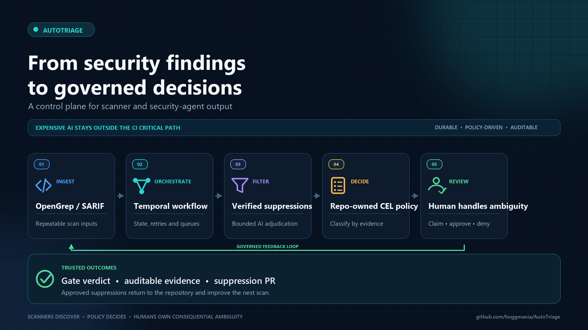

# AutoTriage

LLM or Agentic Security testing combines context with security issues; this has been highly effective with Models such as Mythos. However, the cost security testing with such LLM's within a CI/Pipeline, comes with several issues: -
- costly to excute LLM scanning for every build, especially in high build cadence systems
- delay/blocks build infrastructure (even when LLM execution is separate)
- llm has could access to build environment, dangerous actions maybe permitted
- suitable in-line triage process not part of LLM process (what to allow or not)
- model/RAG training/context specific to consumer should not be part of target source

AutoTriage is a Proof-of-Concept on separation of expensive LLM security testing away from the CI, allowing for blending with more CI friendly tooling; in this case using OpenGrep SARIF results.

The platform runs scans for repositories at defind periods (PRs/schedule), applies suppressions, and then uses LLM-assisted false-positive filtering; low-confidence findings are routed into a reviewer workflow that can create suppression pull requests. CI/pipelines can still run the SAST tooling, with signed supression files, and trust the results for gating purposes. 

## Project Aims

- Automate OpenGrep scanning as a repeatable workflow.
- Reduce noisy findings by applying suppression bundles and optional ZeroFalse AI evaluation.
- Keep human review focused on ambiguous findings (Potential False Positives).
- Enforce policy-driven triage classification from repo-managed CEL rules.
- Provide auditable triage actions and suppression PR automation.

## High-Level Flow

1. A client submits `POST /scans` to `scan-api`.
2. `scan-api` starts `OpenGrepPRScanWorkflow` in Temporal.
3. Workflow activities run in order:
   - resolve repository source
   - fetch and verify suppression bundle
   - run OpenGrep
   - filter/apply suppressions (with optional ZeroFalse)
   - upload results
   - compute final verdict
4. Filter worker can submit low-confidence candidates to `triage-service`.
5. `triage-service` loads CEL policy from the repo default branch (default `.autotriage/policy.cel`) and classifies candidates.
6. Only Potential False Positives are persisted for review.
7. Security reviewers claim/approve/deny findings in triage APIs/UI.
8. On approval, triage automation creates suppression updates in the repo and pushes a branch for PR creation.

## Triage Classification Model

Policy input is intentionally narrow:

- `cweId`
- `confidencePercent`

Default policy bands described in project docs:

- `0-30`: True Positive
- `30-60`: Potential False Positive
- `61-100`: False Positive

## Development

Engineering setup, repository structure, local startup, verification, and configuration have moved to the [development guide](https://hoggmania.github.io/AutoTriage/develope.html).

## Related Docs

- [`develope.md`](develope.md)
- [Architecture](docs/architecture.md)
- [AutoTriage vs. agentic security tools](docs/autotriage-vs-agentic-security-tools.md)
- [Runbook](docs/runbook.md)
- [Triage plan](docs/triage-plan.md)
- [Decision log](docs/decisions/decision-log.md)

## License

AutoTriage is licensed under the [MIT License](LICENSE).
