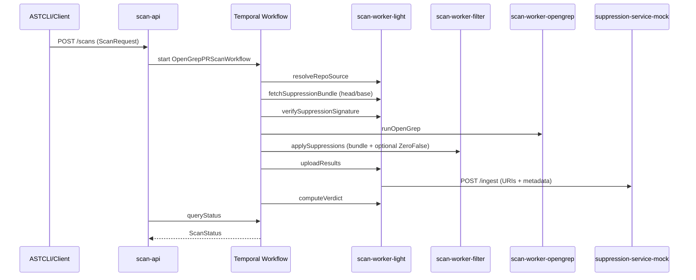

# Architecture Overview

AutoTriage is a Temporal-driven OpenGrep scanning platform structured as a Maven multi-module repository. The parent module coordinates the following actionable submodules:

- `scan-common`: shared DTOs, Temporal workflow/activities interfaces, and serialization helpers.
- `scan-api`: Quarkus HTTP entry point that validates ASTCLI requests, talks to Temporal via `scan-workflows` queue, and exposes `/scans` REST bindings plus `/health`.
- `scan-worker-workflow`: Temporal worker that hosts `OpenGrepPRScanWorkflowImpl` and orchestrates the activity graph on the `scan-workflows` task queue.
- `scan-worker-light`: light-weight activities (repo resolve, suppression fetch/verify, upload, verdict) which run against `scan-light` queue with higher retry counts.
- `scan-worker-filter`: SARIF suppression activity that filters heavy OpenGrep output, including optional ZeroFalse LLM adjudication; ticketed on `scan-filter` queue.
- `scan-worker-opengrep`: heavy OpenGrep execution container running on `scan-opengrep` queue with heartbeat-enabled, short retry policies.

Temporal namespace `scan-platform` hosts all workflows. The primary workflow (`OpenGrepPRScanWorkflow`) drives the ordered activities: resolve repo, fetch/verify suppressions, run OpenGrep, apply suppressions (optionally adjudicating alerts via ZeroFalse using the source archive for context), upload results, compute verdict, and update queryable status between steps; suppression bundles are sourced from the PR head ref when provided and fall back to base ref. The API and workers ship structured logging enriched with `runId`/`repo`/`prNumber`/`sha`. Configuration surfaces via environment variables so Kubernetes manifests can mount TLS certs and queue names without code changes, including `TEMPORAL_TARGET`, `TEMPORAL_NAMESPACE`, `TEMPORAL_TLS_ENABLED`, `TEMPORAL_TLS_CLIENT_CERT_PATH`, `TEMPORAL_TLS_CLIENT_KEY_PATH`, `TEMPORAL_TLS_SERVER_CA_PATH`, `SUPPRESSION_SERVICE_URL`, `ARTIFACTS_DIR`, `GIT_CLONE_TOKEN`, `OPENGREP_BIN`, `OPENGREP_CONFIG`, ZeroFalse controls (`ZEROFALSE_ENABLED`, `ZEROFALSE_MAX_FINDINGS`, `ZEROFALSE_MAX_TRACE_STEPS`, `ZEROFALSE_CONTEXT_LINES_BEFORE`, `ZEROFALSE_CONTEXT_LINES_AFTER`, `ZEROFALSE_PROMPTS_VARIANT`), and the verdict gate settings (`GATE_POLICY_FAIL_ON_ANY`, `GATE_POLICY_MAX_HIGH`, `GATE_POLICY_MAX_MEDIUM`, `GATE_POLICY_MAX_LOW`).

Health endpoints run in each Quarkus service to satisfy the operational requirement, and Dockerfiles live in `docker/` for each runnable module. The filter worker produces a `suppression-report-*.json` alongside `final.sarif`, and the light worker uploads SARIF URIs plus the report URI to the suppression service mock. A GitHub Actions workflow enforces formatting + unit tests as the CI gate.

